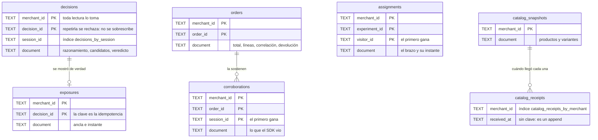
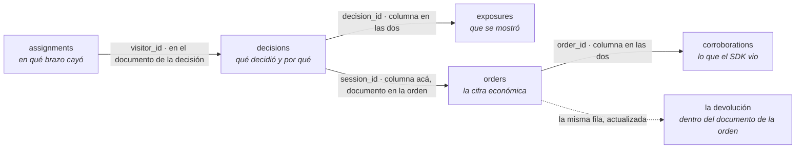

# migrations/ — la forma del almacén durable, versionada

El esquema del almacén se versiona acá (feature 030, FR-007) **para que un cambio de la forma de
los datos se revise en una PR como cualquier otro cambio**. No es un detalle de despliegue: es la
única parte de la persistencia que alguien puede leer entera sin correr nada.

Un archivo es `NNN-<nombre>.sql`, y `NNN` es la **versión que el esquema tiene después de
aplicarlo**. Cada archivo fija esa versión con `PRAGMA user_version = NNN`, que es de dónde el
arranque la lee.

## La forma de hoy

En cada tabla hay columnas para **dos cosas nada más**: el merchant, que toda lectura toma y que es
de lo que está hecho el aislamiento (constitución V), y **la clave por la que el puerto busca**. Todo
lo demás viaja en `document`, tal como el dominio lo tiene.

**Ninguna de esas líneas es una clave foránea**, y el diagrama las dibuja igual porque es lo que un
ER sabe dibujar: son las que unen **columna con columna**, y el motor no las vigila. La cadena de
evidencia entera se une por identificadores, y varios de ellos viven dentro del documento:

**Por qué no se desarma cada entidad en columnas**: el ledger es inmutable y append-only, así que no
hay actualizaciones parciales que lo justifiquen, y desarmarlo obligaría a mantener **dos formas del
mismo dominio** en paso — la duplicación que ADR-024 evita en el código. La excepción es `orders`,
que una devolución sí actualiza: eso es la máquina de estados de ADR-028, no una edición de lo que la
plataforma mandó.

**Dos cosas que no son columnas y podrían parecerlo.** El orden de inserción no lo lleva ninguna: es
el `rowid` de SQLite, así que «en el orden en que se registraron» no depende de un contador que
pueda discrepar de la realidad. Y cuántos recibos se guardan **llega con cada escritura**, porque es
política del merchant y no del esquema (constitución XI).

## Qué hace el arranque con esto

`src/infrastructure/sqlite/open-store.ts` lee este directorio y **pide las versiones en orden —1, 2,
3— en vez de ordenar lo que encuentra**. `readdirSync` no promete ningún orden (ext4 responde en
orden de hash), así que ordenar sería lo único entre una aplicación correcta y una silenciosa, y
ninguna prueba puede desordenar un listado de directorio para demostrar que funciona. Pedirlas en
turno no necesita comparador y encuentra gratis el otro error: **un hueco**, que es lo que parece una
migración perdida en un merge. La última que pide es la versión que la build espera.

Entonces:

- **Archivo vacío y sin tablas** → aplica todas, en ese orden.
- **Una versión entre 1 y la esperada** → aplica **sólo las pendientes**, cada una en su transacción.
  Estar al día no es un caso especial: es ese mismo recorrido sin encontrar nada que hacer.
- **Un hueco en la numeración** (001 y 003, sin 002) → **no arranca**, nombrando la que falta.
- **Cualquier otra cosa** —una versión mayor que la que la build conoce, o versión 0 con tablas
  adentro— → **no arranca, y dice qué esperaba** (FR-006). Un servidor que arranca sobre algo que no
  entiende es peor que uno que no arranca: falla más tarde y en otro lado.

Un arranque rechazado **cierra la base que había abierto**; no deja la conexión detrás.

**Cada migración va en su propia transacción**, y eso es lo que vuelve segura una que **reconstruye**
una tabla —crear, copiar, borrar, renombrar, que es lo que SQLite obliga para agregar una clave
primaria—: se aplica entera o ninguna. Sin la transacción, un fallo a mitad dejaría el almacén en una
forma que no es ni la vieja ni la nueva, con `user_version` diciendo la vieja, y el arranque
siguiente correría la misma migración sobre los restos.

**La migración hacia adelante llegó en la feature 031.** La 030 la había dejado afuera con su motivo
—no había datos en ninguna parte, así que un almacén sólo podía estar vacío o al día— y la segunda
migración del repositorio volvió ordinario el caso de un almacén una versión atrás.

## Qué hace cada clave cuando la escritura se repite

No es un detalle de implementación: es lo que hace de esto un ledger y no una tabla cualquiera, y
cada tabla lo decide con su clave primaria, no con una lectura previa del llamador.

| Tabla               | Una segunda escritura con la misma clave                                                         |
| ------------------- | ------------------------------------------------------------------------------------------------ |
| `decisions`         | **se rechaza**: el ledger no se sobrescribe, y la escritura degrada a `NO_OP ledger-unavailable` |
| `exposures`         | no hace nada y responde `already-recorded`: es la idempotencia de la confirmación                |
| `corroborations`    | no hace nada y responde `repeated`: el primero gana                                              |
| `assignments`       | no hace nada: el primer brazo gana, y por eso el visitante vuelve al mismo                       |
| `orders`            | la decide el puerto dentro de una transacción: primero, repetido o **conflicto**, sin pisar nada |
| `catalog_snapshots` | reemplaza: una publicación supersede a la anterior, que es lo que una instantánea significa      |
| `catalog_receipts`  | no aplica: no tiene clave, es un append que se poda al tope que el merchant fija                 |

`decisions` rechaza en vez de conservar en silencio porque un identificador repetido ahí no es una
repetición: es un generador roto, y perder la evidencia de la primera decisión sería la peor forma
de enterarse.

## Cómo se agrega una

1. Un archivo nuevo, con **el número siguiente sin saltear ninguno**, que termina en
   `PRAGMA user_version = NNN`. El arranque rechaza un hueco.
2. Su fila en el inventario de abajo.
3. La suite de durabilidad (`npm run test:durability`), que abre un almacén vacío y verifica que el
   esquema que queda es el que la build espera — y que la versión que el archivo fija es la que su
   nombre anuncia.

## Inventario

| Entrada                      | Qué es                                                                                                                                               | Versión que deja | Fuente o derivado | Quién lo lee                                       | Verificación                     |
| ---------------------------- | ---------------------------------------------------------------------------------------------------------------------------------------------------- | ---------------- | ----------------- | -------------------------------------------------- | -------------------------------- |
| `001-ledger-and-catalog.sql` | La primera forma: una tabla por entidad del ledger —decisiones, exposiciones, órdenes, corroboraciones, asignaciones— más el catálogo y sus recibos. | 1                | fuente            | `src/infrastructure/sqlite/open-store.ts` al abrir | `tests/durability/store.test.ts` |
